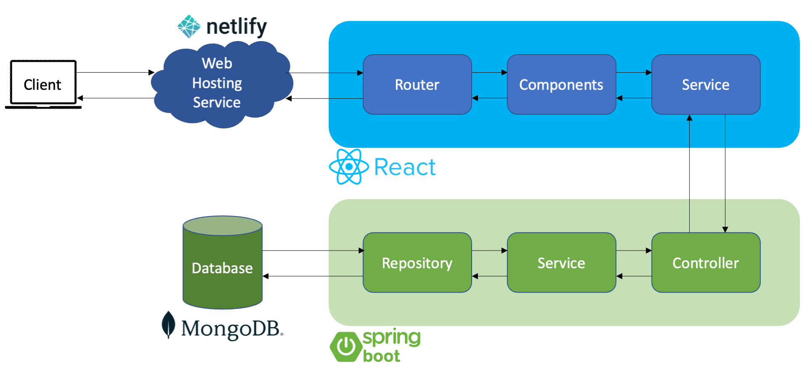

# Personal Website with ReactJS

A personal website to showcase projects, publications and relevant skills.

The general architecture is shown in the following figure:

## Front End 
The front end is developed with ReactJS to create a responsive and dynamic website.

The components and pages definitions can be found in [src/components](/src/components/) and [src/pages](/src/pages/) respectively.

## Back End 
The back end is developed with Spring Boot for its ease of implementation and extensive range of supported dependencies.

Upon queries from the client through the front end, it retrieves the data from the database, hosted on MongoDB Atlas for high availability.

The implementation of the backend API can be found in the repository [personal-website-api](https://github.com/elvistkf/personal-website-api).
